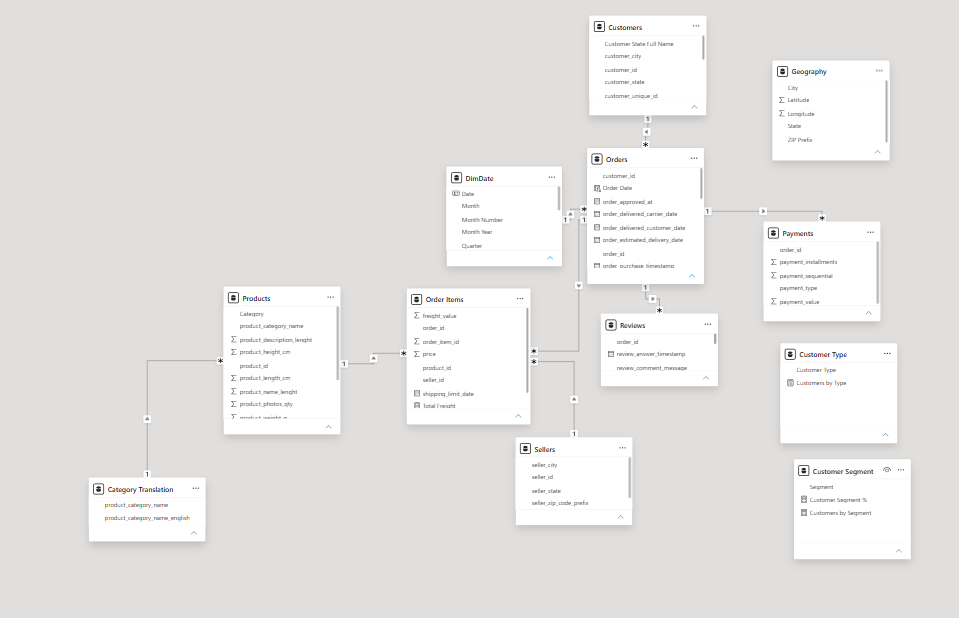

# Olist E-Commerce Business Intelligence Dashboard

A professional Power BI Business Intelligence solution designed to analyze
e-commerce sales performance, customer behavior, product performance,
geographic concentration, and operational efficiency.

## Project Overview

This project transforms e-commerce transactional data into an interactive
6-page Power BI dashboard designed for executive and management decision-making.

The dashboard answers key business questions including:

- How is revenue performing?
- Which categories drive revenue?
- Where is the business geographically concentrated?
- How are customers behaving?
- Which products/categories require attention?
- Where are delivery problems occurring?
- What actions should management take?

## Dashboard Pages

### 1. Executive Overview
Provides an overall snapshot of:
- Revenue
- Orders
- Customers
- Average Order Value
- Ratings
- Delivery performance
- Revenue trends

### 2. Sales & Revenue Analysis
Analyzes:
- Revenue trends
- Order trends
- Category performance
- Product performance
- Geographic revenue
- Revenue contribution

### 3. Customer Analytics
Analyzes:
- Customer distribution
- Repeat customers
- Customer spending
- Customer segmentation
- Customer geography

### 4. Product & Category Performance
Analyzes:
- Category revenue
- Product performance
- Customer ratings
- Top and bottom products
- Revenue vs rating

### 5. Operations & Delivery
Analyzes:
- Delivery performance
- Late delivery rate
- Average delivery days
- Geographic operational risk
- Category delivery performance

### 6. Business Insights & Recommendations
Converts analytical findings into:
- Business insights
- Customer retention opportunities
- Category opportunities
- Operational risks
- Management recommendations

## Key Technologies

- Power BI
- DAX
- Power Query
- Data Modeling
- Star Schema
- Business Intelligence
- Data Visualization
- Customer Analytics
- Sales Analytics
- Operational Analytics

## Data Model

The solution uses a relational/star-schema-oriented model containing:

- Customers
- Orders
- Order Items
- Products
- Sellers
- Payments
- Reviews
- Geography
- Category Translation

## Key KPIs

- Total Revenue
- Total Orders
- Total Customers
- Average Order Value
- Revenue Growth %
- Average Rating
- Repeat Customer Rate
- On-Time Delivery %
- Late Delivery %
- Average Delivery Days
- Revenue Contribution %

## Business Insights

Some of the major findings include:

- Merchandise revenue of approximately ₹13.59M
- Approximately 20% revenue growth between 2017 and 2018
- Repeat customer rate of approximately 3.12%
- São Paulo contributes approximately 38.3% of revenue
- São Paulo and Rio de Janeiro together contribute approximately 51.7%
- Freight represents approximately 16.6% of merchandise revenue
- Delivery and product-quality opportunities identified through category and geographic analysis

## Skills Demonstrated

- Business Analysis
- KPI Design
- Data Modeling
- DAX
- Power Query
- Data Visualization
- Customer Segmentation
- Sales Analytics
- Operational Analytics
- Executive Reporting
- Business Storytelling